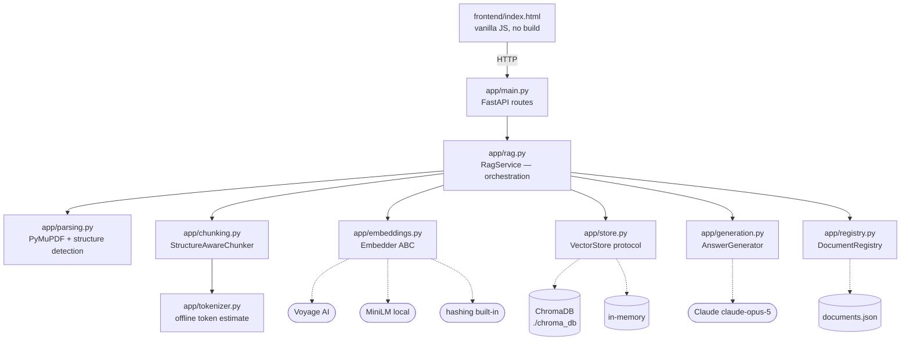
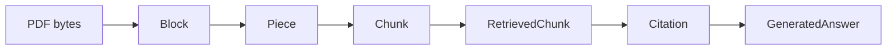
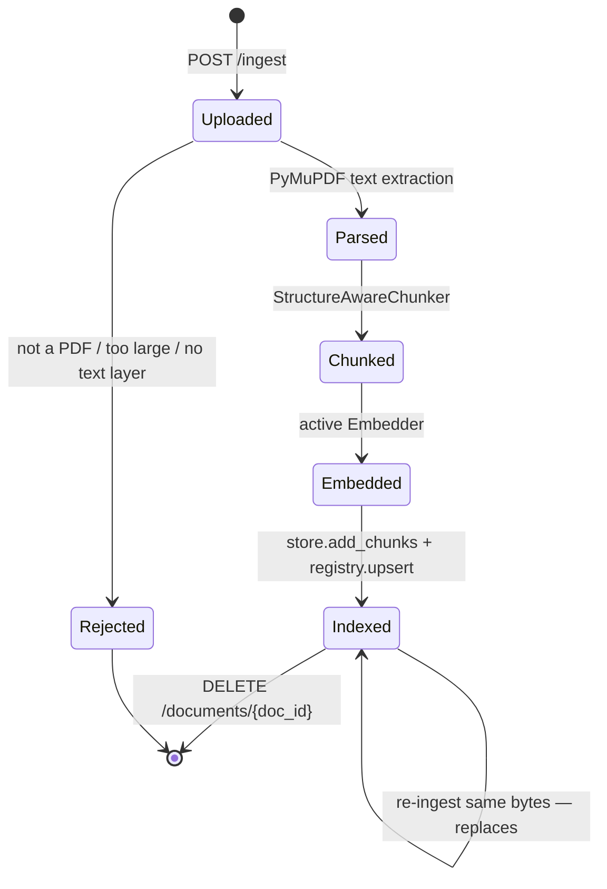
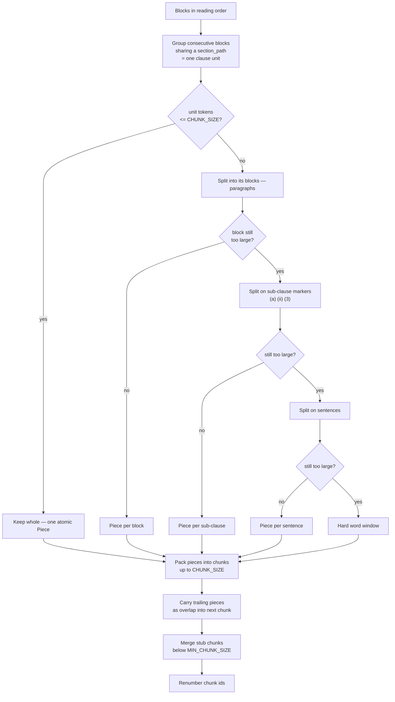
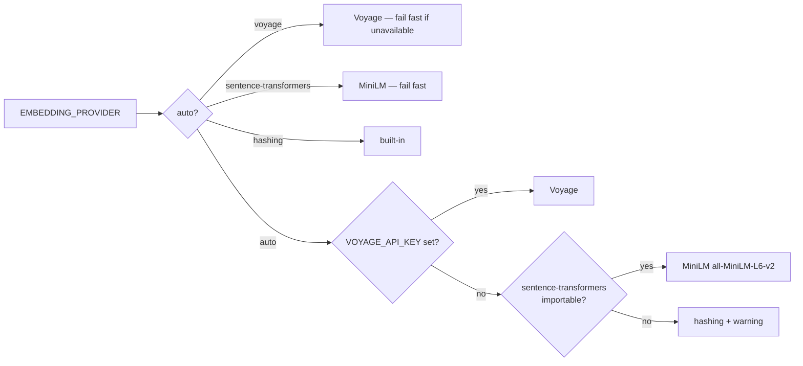
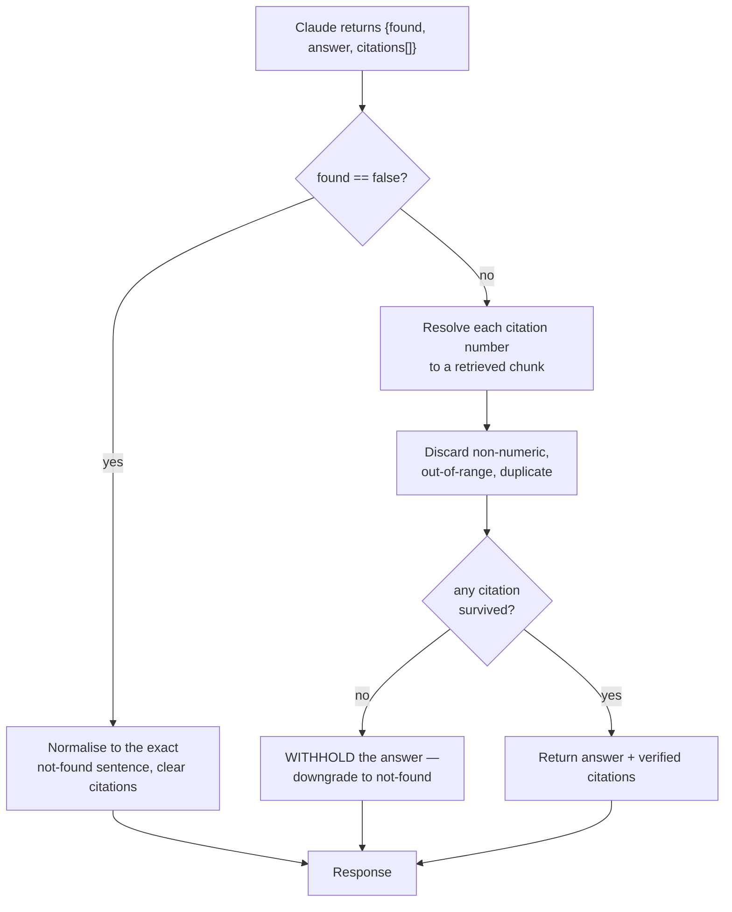
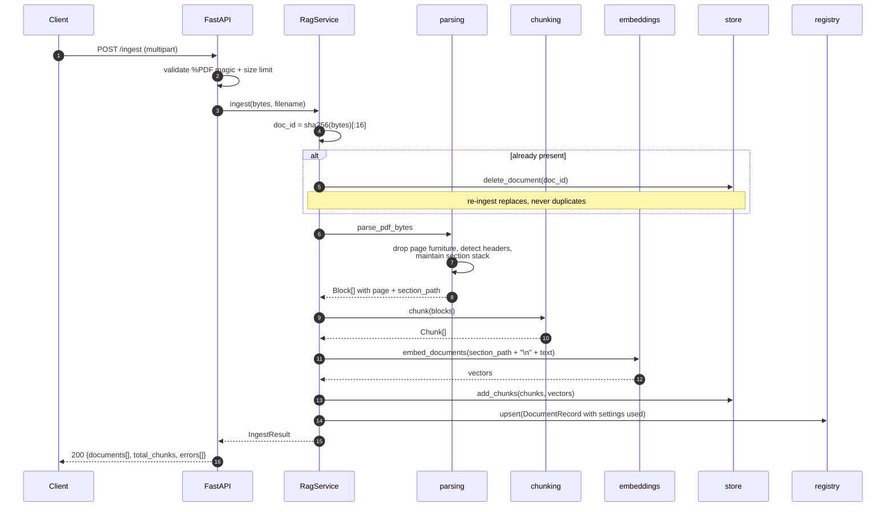
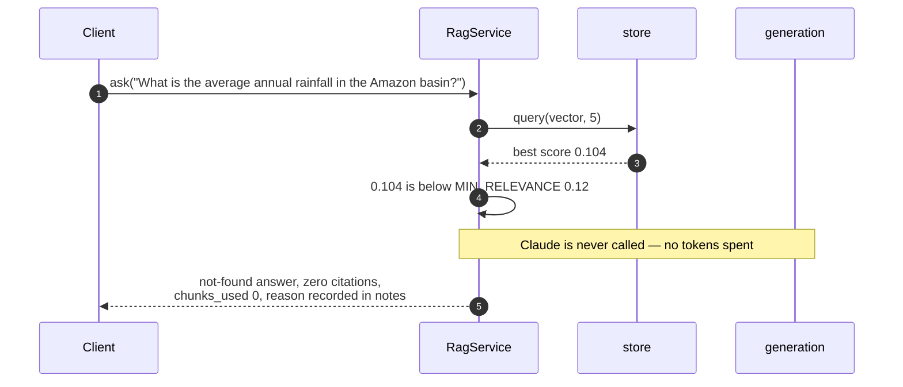

# Endorsement Desk — Design Document

RAG over insurance endorsement packs, built so that every answer is traceable to
a filename, a page and a clause.

| | |
|---|---|
| **Repository** | `insurance-rag/` |
| **Runtime** | Python 3.11+, FastAPI, ChromaDB |
| **Answering model** | `claude-opus-5` via the `anthropic` SDK |
| **Embeddings** | Voyage AI → sentence-transformers → built-in hashing |
| **Status** | 57 tests, 55 passing, 2 skipped without an API key |

---

## Table of contents

1. [Design principles](#1-design-principles)
2. [Architecture](#2-architecture)
3. [Data model](#3-data-model)
4. [RAG documents and the corpus model](#4-rag-documents-and-the-corpus-model)
5. [Chunking strategy](#5-chunking-strategy)
6. [Retrieval and the relevance gate](#6-retrieval-and-the-relevance-gate)
7. [Generation and the citation guarantee](#7-generation-and-the-citation-guarantee)
8. [Flows](#8-flows)
9. [API reference](#9-api-reference)
10. [Configuration reference](#10-configuration-reference)
11. [Test scenarios](#11-test-scenarios)
12. [End-to-end walkthrough](#12-end-to-end-walkthrough)
13. [Failure modes](#13-failure-modes)
14. [Extension points](#14-extension-points)

---

## 1. Design principles

Four rules decided most of the code below. They are listed in priority order —
where two conflict, the earlier one wins.

**1. Citation correctness over cleverness.** An insurance analyst has to defend
an answer to an auditor. An answer that is right but unciteable is worth less
than a narrower answer that can be checked. Every design fork resolved this way.

**2. An uncited answer is not shippable.** If the model produces an answer and
no citation survives verification, the answer is withheld and replaced with the
not-found response. Silently shipping an unsourced claim is the worst outcome
the system can produce, so it is made structurally impossible.

**3. The clause is the unit of meaning.** Not the page, not a 512-token window.
Chunking, metadata, and citation display are all built around clause boundaries.

**4. Degrade loudly, never silently.** No credentials → `503` with the fix in
the message, not a 500. A scanned PDF → a clear rejection, not an empty index.
An out-of-range citation → discarded and recorded in `notes`, not passed through.

---

## 2. Architecture

### Component diagram



### Modules

| Module | Responsibility | Knows about |
|---|---|---|
| `app/main.py` | HTTP surface, upload validation, error → status mapping | `RagService`, schemas |
| `app/rag.py` | Orchestration, the relevance gate, document lifecycle | every component below |
| `app/parsing.py` | PDF → blocks tagged with page and section path | PyMuPDF only |
| `app/chunking.py` | Blocks → overlapping, clause-respecting chunks | tokenizer only |
| `app/tokenizer.py` | Offline token estimation | nothing |
| `app/embeddings.py` | Provider resolution and vectorisation | Voyage / ST SDKs |
| `app/store.py` | Vector persistence and cosine search | ChromaDB |
| `app/registry.py` | Document manifest behind `GET /documents` | filesystem |
| `app/generation.py` | Prompt assembly, the Claude call, citation verification | `anthropic` SDK |
| `app/models.py` | Frozen dataclasses shared by every layer | nothing |
| `app/schemas.py` | Pydantic request/response shapes | `models`, `rag` |
| `app/config.py` | Environment-driven settings | nothing |

### Dependency rules

- **Dependencies point inward.** `parsing`, `chunking`, `tokenizer` and `models`
  import nothing from the service or HTTP layers, which is what makes the
  chunker unit-testable without a store, a model or a network.
- **`rag.py` is the only module that knows all the parts.** Swapping Voyage for
  MiniLM, or Chroma for something else, touches exactly one file.
- **Wire types are separate from domain types.** `app/models.py` holds frozen
  dataclasses used internally; `app/schemas.py` holds the Pydantic models that
  define the HTTP contract. The API can evolve without dragging ingestion along.
- **Every external dependency is injectable.** `RagService(settings, embedder=,
  store=, registry=, generator=, chunker=)` — which is how the test suite runs
  with no API key, no model download and no writable Chroma directory.

---

## 3. Data model

Objects in the order they come into existence during ingestion.



### `Block` — one logical paragraph

| Field | Type | Notes |
|---|---|---|
| `text` | `str` | de-hyphenated, whitespace-collapsed |
| `page` | `int` | 1-based |
| `doc_id`, `filename` | `str` | provenance |
| `section_path` | `tuple[str, ...]` | e.g. `("ENDORSEMENT NO. 1 - FLOOD SUB-LIMIT AMENDMENT", "SECTION 4 - CONDITIONS", "4.2 Exclusions")` |
| `clause_label` | `str \| None` | deepest numbered clause |
| `kind` | `"heading" \| "body"` | |

### `Piece` — a splittable span

Intermediate, internal to the chunker. Starts life as a whole clause and is only
broken down if the clause exceeds the target.

| Field | Notes |
|---|---|
| `text`, `tokens` | |
| `page_start`, `page_end` | preserved through splitting so page attribution stays exact |
| `section_path`, `clause_label` | inherited from the clause |
| `is_partial` | `True` once it is a fragment of an oversized clause |
| `is_overlap` | `True` when it is repeated text carried over as overlap |

`is_overlap` exists so that carried-over text cannot decide the new chunk's
citation label or page range — the overlap belongs to the *previous* clause.

### `Chunk` — the embeddable unit

| Field | Notes |
|---|---|
| `chunk_id` | `{doc_id}::{index:04d}`, dense and ordered |
| `doc_id`, `filename` | |
| `text`, `tokens` | |
| `page`, `page_end` | a chunk may span a page break |
| `section_path` | `" > "`-joined string, flat for ChromaDB |
| `clause_label` | |
| `chunk_index` | |
| `is_partial_clause` | chunk holds a slice of a clause too large to keep whole |

`to_metadata()` emits exactly these as flat scalars — ChromaDB rejects nested
metadata values.

### `RetrievedChunk`, `Citation`, `GeneratedAnswer`

`RetrievedChunk` adds a cosine `score` and a `section` display property.
`Citation` is the verified pointer surfaced to the client — `filename`, `page`,
`section`, plus `chunk_id`, `score` and a `snippet` so a citation can be checked
without a second request. `GeneratedAnswer` carries `answer`, `found`,
`citations`, `chunks_used`, `model`, `stop_reason` and `notes` — where `notes`
records anything the verifier discarded.

### `DocumentRecord` — the manifest entry

`doc_id`, `filename`, `pages`, `blocks`, `chunks`, `tokens`, `sha256`,
`ingested_at`, **`chunk_size`, `chunk_overlap`, `embedding_model`**.

The last three are the point of the record: they let you see that the store
holds vectors built under two different configurations, which is otherwise
invisible and produces baffling retrieval behaviour.

---

## 4. RAG documents and the corpus model

### What a document is

A document is one PDF. Its identity is **content-addressed**:

```python
doc_id = sha256(file_bytes).hexdigest()[:16]
```

Consequences, all deliberate:

- Re-uploading the same bytes is **idempotent** — the old chunks are deleted and
  replaced rather than duplicated. This is what makes "re-run ingestion at a
  different chunk size" a safe operation rather than a corpus-corrupting one.
- The same file under two names is one document. A different revision under the
  same name is a new document, and both are retained — correct for endorsements,
  where revision history matters.
- `sha256` is stored in full on the record, so a document can be matched against
  a source system.

### Document lifecycle



### Two storage surfaces

| | ChromaDB | `documents.json` |
|---|---|---|
| Holds | one row per chunk: id, text, vector, metadata | one row per document |
| Answers | "which passages match this question?" | "what is loaded, and under what settings?" |
| Location | `CHROMA_DIR` (default `./chroma_db`) | `CHROMA_DIR/documents.json` |
| Writes | `upsert` / `delete(where={"doc_id": …})` | temp file + `os.replace`, so a crash cannot truncate it |

The manifest is not derived from chunk metadata on purpose: deriving it means
scanning every vector to answer `GET /documents`, and it cannot record
document-level facts like page count or the ingestion settings.

### The sample corpus

`scripts/make_sample_pdf.py` generates a synthetic endorsement pack rather than
shipping a binary fixture or a real, confidential policy. It is built to
exercise every structural feature the parser claims to handle:

| Feature | Where in the sample |
|---|---|
| `ENDORSEMENT NO. n` headers | three endorsements |
| `SECTION n` and all-caps headings | `SECTION 4 - CONDITIONS…`, `GENERAL CONDITIONS` |
| Multi-level numbering | `4.1`, `4.2`, `4.2.1` |
| Single-level numbering | `1.`, `2.`, `3.` |
| A clause label sharing its line with body text | `3. The Insured shall give written notice…` |
| A restated clause number | heading `3. NOTIFICATION OF CLAIM` then body `3. …` |
| Sub-clause markers | `(a)`–`(e)` in clause 4.2, `(a)`–`(h)` in the cyber exclusion |
| A clause far larger than any chunk target | the cyber exclusion, ~800 tokens |
| Running page footers | `Page n of m`, which must be filtered out |

Resulting shape: **4 pages, 48 blocks, 7 chunks, 3,112 tokens** at the default
550/120 configuration.

The module also exports `EVAL_QUESTIONS` — eight questions paired with the fact
each answer depends on and the clause that carries it — and
`OUT_OF_SCOPE_QUESTION`. Both the test suite and the chunk-size comparison use
them, so "retrieved the right passage" means the same thing in both places.

### Metadata contract

Every chunk carries `{doc_id, filename, page, section_path, chunk_id}` plus
`page_end`, `clause_label`, `tokens`, `chunk_index`, `is_partial_clause`.
`test_every_chunk_carries_full_citation_metadata` asserts the required five are
present, non-empty and unique per chunk.

### One deliberate asymmetry

The section path is **prepended to the text that gets embedded, never to the
text that gets stored or cited**:

```python
# app/rag.py
def _embedding_text(self, chunk: Chunk) -> str:
    if chunk.section_path:
        return f"{chunk.section_path}\n{chunk.text}"
    return chunk.text
```

A question phrased in the language of a heading — *"what does the flood
endorsement exclude?"* — can then match a clause whose body never repeats the
words "flood endorsement", while the citation still shows exactly the source
text and nothing synthesised.

---

## 5. Chunking strategy

### The problem

A fixed sliding window that cuts `4.2 Exclusions` in half produces two chunks
that are each individually plausible and each wrong:

- one carries the exclusion without the trigger that scopes it,
- the other carries the trigger without the exclusion.

Retrieval will happily return either. Neither is detectably broken to a reader.
This is the specific failure the splitter exists to prevent.

### The algorithm

Descend only as far as necessary.



**Step 1 — clause boundaries first.** Consecutive blocks sharing a section path
become one clause unit. A clause that fits within the target is *never* split;
several small clauses are packed together instead, up to the target.

**Step 2 — recursive fallback, oversized clauses only.** paragraph → sub-clause
marker → sentence → hard word window. Each level is tried in turn and only on
segments still too large. The recursion never revisits a separator that already
failed to divide a segment.

**Step 3 — overlap by whole pieces.** When a chunk is flushed, trailing pieces
worth up to `CHUNK_OVERLAP` tokens seed the next chunk, so overlap normally
begins at a clause or paragraph boundary. Two refinements matter in practice:

- If the trailing pieces total less than 60% of the budget, the overlap is
  topped up with a sentence-aligned tail of the piece before them.
- If the final piece alone exceeds the budget — common, since clauses run to
  several hundred tokens — a sentence-aligned tail of *it* is used. Without this
  fallback, overlap would frequently be zero.

Measured on the sample pack at 550/120: realised overlap **81–119 tokens**
against a 120-token budget, always landing on a clause or sentence boundary.

**Step 4 — tidy-up.** Chunks below `MIN_CHUNK_SIZE` are merged into their
predecessor when there is room. This only ever *joins* text, so it cannot
violate the never-split guarantee. Chunk ids are then renumbered so they stay
dense and ordered.

### Invariants

| Invariant | Enforced by | Tested by |
|---|---|---|
| A clause that fits is never split | step 1 treats it as an atom | `test_no_clause_that_fits_is_ever_split` |
| No chunk exceeds `CHUNK_SIZE` | packing checks before appending; the word window bounds the worst case | `test_chunks_respect_the_target_size` |
| Adjacent chunks always overlap | whole-piece carry with tail-slice fallback | `test_adjacent_chunks_overlap` |
| Overlap never exceeds the budget | carry loop is budget-bounded | same test |
| Sub-clauses stay with their parent | `(a)` markers are split points, not path entries | `test_exclusion_subclauses_stay_with_their_clause` |
| Page attribution is exact | pages tracked per block through splitting | `test_pages_are_monotonic_and_within_the_document` |
| Overlap does not corrupt labels | `is_overlap` pieces excluded from label/page derivation | — |

### Why 500–600 tokens

- A typical numbered clause plus its sub-items is 100–250 tokens, so 500–600
  fits **two or three whole clauses** — enough neighbouring context to interpret
  a clause without the citation ballooning to half a page.
- Measured: recall@5 reaches 100% at 600 with 1.20× storage overhead, versus
  88% and 1.61× at 300.
- Below ~400 the long exclusion wordings that matter most start fragmenting.
  Above ~800 a citation stops being a useful pointer for a human checking source.

Full comparison: [§12](#12-end-to-end-walkthrough) and
`docs/chunk-size-comparison.md`.

### Token estimation

Chunk sizing uses an offline heuristic (`app/tokenizer.py`): whitespace and
punctuation-split pieces, long pieces charged at ~4 characters per token.

Two things deliberately *not* used:

- **`tiktoken`** — OpenAI's tokenizer. It undercounts Claude tokens by roughly
  15–20% on prose and much more on identifiers, so sizing against it silently
  produces oversized prompts.
- **`client.messages.count_tokens`** — accurate for Claude, but a network
  round-trip per call, which makes ingestion slow, non-deterministic and
  dependent on an API key.

The estimate is **uncalibrated** and labelled "estimated tokens" everywhere it
surfaces. That is acceptable for a chunk *target*, which only needs to be
consistent. `StructureAwareChunker` accepts a `token_counter` argument if you
want to swap in the exact one.

---

## 6. Retrieval and the relevance gate

### Retrieval

1. Embed the question with the active embedder (`embed_query`, which for Voyage
   uses `input_type="query"` — asymmetric embedding measurably helps).
2. Cosine search over the store, `top_k` defaulting to 5.
3. Scores are always returned as **cosine similarity in `[-1, 1]`**, never a raw
   distance — Chroma's cosine distance is converted with `1 - distance` at the
   store boundary so the rest of the system has one scale to reason about.

### Embedding provider resolution



The hashing embedder is signed feature hashing over word uni/bi-grams and
intra-word character 4-grams, stop-words removed, sub-linear TF, BLAKE2b so
vectors are stable across processes (Python randomises string hashing per run).
It exists so the whole system runs with no API key and no PyTorch. It is a real
lexical retriever, not a stub — but it has no semantic generalisation.

Removing stop-words was not cosmetic: before it, *"What is the average annual
rainfall in the Amazon basin?"* matched a policy front page at 0.17 on
`what/is/the/average/annual` alone. After, that drops to 0.10 while in-scope
scores rise.

### The relevance gate

If the *best* retrieved chunk scores below `MIN_RELEVANCE`, `/ask` returns the
not-found answer **without calling Claude**.

**The gate is a cost optimisation, not the correctness mechanism.** What
actually prevents fabricated answers is the model contract plus citation
verification ([§7](#7-generation-and-the-citation-guarantee)). So the gate is
biased deliberately *low*: letting a doubtful question through to the model is
cheap and safe; suppressing a good question is not.

This matters because **the threshold is not portable**. Measured on the sample
pack with the hashing embedder, across eight in-scope and seven out-of-scope
questions:

| `CHUNK_SIZE` | in-scope min top-1 | out-of-scope max top-1 | gap |
|---|---|---|---|
| 300 | 0.132 | 0.169 | **−0.037** |
| 550 | 0.130 | 0.104 | +0.026 |
| 600 | 0.176 | 0.123 | +0.053 |
| 1000 | 0.099 | 0.124 | **−0.025** |

At 300 and 1000 tokens *no* threshold separates the populations with this
embedder — larger chunks carry more vocabulary and so match anything slightly
better. The shipped default (`MIN_RELEVANCE=0.12`) is measured against the
shipped `CHUNK_SIZE=550`. **Re-tune it whenever you change the embedding
provider or the chunk size**, and read a negative gap as "the gate is off, the
model is doing the work" rather than as a bug.

---

## 7. Generation and the citation guarantee

### Prompt assembly

Retrieved chunks are rendered as numbered, labelled passages:

```
[1] filename: pack.pdf | page: 1 | section: ENDORSEMENT NO. 1 - FLOOD SUB-LIMIT
    AMENDMENT > 2. AMENDMENT TO LIMIT | chunk_id: 77e3…::0000
The sub-limit applicable to loss or damage caused by Flood is amended from
GBP 2,500,000 to GBP 5,000,000 in the annual aggregate…
```

The system prompt restricts Claude to those passages, forbids prior knowledge,
requires a citation for every factual statement, specifies the exact not-found
sentence, and instructs it to flag conflicts between an endorsement and a base
clause rather than silently picking one.

### Model configuration

| Setting | Value | Why |
|---|---|---|
| Model | `claude-opus-5` | |
| Thinking | adaptive (the default on Opus 5) | grounded extraction over legal prose benefits from it; disabling it on Opus 5 has known failure modes |
| `output_config.effort` | `medium` | good balance for extraction; raise via `ANSWER_EFFORT` |
| `max_tokens` | 16000 | caps thinking **and** answer together, hence the headroom |
| `output_config.format` | JSON schema | guarantees the response parses |

### The three-stage guarantee



1. **Structured output** means the reply always parses — the verifier never has
   to cope with prose where JSON was expected.
2. **Citation resolution** maps each claimed passage number back to a real
   retrieved chunk. Numbers that do not resolve are discarded and recorded in
   `notes`. A citation the model invented cannot survive this step.
3. **Withholding.** If `found` is true but nothing resolves, the answer is
   replaced with the not-found response. This is principle 2 made structural.

### Other outcomes handled explicitly

| Condition | Behaviour |
|---|---|
| `stop_reason == "refusal"` | Distinct message naming the refusal category, `found: false`, no citations |
| `stop_reason == "max_tokens"` | Recorded in `notes`; unparseable output falls back to not-found |
| Unparseable response | Not-found with `"unparseable model response"` in `notes` |
| No credentials | `GenerationUnavailableError` → HTTP `503` with the fix in the message |
| `output_config` rejected by an older API | One retry with prompt-level JSON instructions |

---

## 8. Flows

### Ingestion



Per-file failures are collected into `errors[]` while the remaining files still
ingest; `400` is returned only if nothing succeeded.

### Ask — the happy path

```mermaid
sequenceDiagram
    autonumber
    participant C as Client
    participant API as FastAPI
    participant RS as RagService
    participant E as embeddings
    participant V as store
    participant G as generation
    participant CL as Claude

    C->>API: POST /ask {question, top_k?}
    API->>RS: ask(question, top_k)
    RS->>E: embed_query(question)
    E-->>RS: vector
    RS->>V: query(vector, top_k)
    V-->>RS: RetrievedChunk[] with cosine scores
    RS->>RS: gate — best score >= MIN_RELEVANCE?
    RS->>G: generate(question, retrieved)
    G->>G: build numbered, labelled passages
    G->>CL: messages.create(system, context, json_schema)
    CL-->>G: {found, answer, citations:[1,3]}
    G->>G: resolve citations → real chunks;<br/>discard anything unresolvable
    G-->>RS: GeneratedAnswer
    RS-->>API: AskOutcome
    API-->>C: 200 {answer, citations[], chunks_used, found, retrieval[], notes[]}
```

### Ask — gated before the model



### Ask — fabricated citation

```mermaid
sequenceDiagram
    autonumber
    participant G as generation
    participant CL as Claude

    G->>CL: 5 passages, numbered 1 to 5
    CL-->>G: found true, answer "The sub-limit is GBP 9,999,999",<br/>citations 99
    G->>G: 99 is not in 1 to 5 — discard
    G->>G: zero citations survived
    Note over G: principle 2 — an uncited answer is not shippable
    G-->>G: downgrade to not-found;<br/>notes record the discarded citation<br/>and the withheld answer
```

---

## 9. API reference

Base URL `http://127.0.0.1:8000`. Interactive docs at `/docs`.

| Method | Path | Purpose |
|---|---|---|
| `POST` | `/ingest` | Upload and index one or more PDFs |
| `POST` | `/ask` | Answer a question from the indexed corpus |
| `GET` | `/documents` | List what is indexed and under which settings |
| `DELETE` | `/documents/{doc_id}` | Remove a document and its chunks |
| `GET` | `/health` | Resolved configuration and store status |
| `GET` | `/ui/` | The single-page frontend (`/` redirects here) |

### `POST /ingest`

`multipart/form-data`, repeated field `files`.

```bash
curl -F "files=@data/sample_endorsement_pack.pdf" http://127.0.0.1:8000/ingest
```

```json
{
  "documents": [{
    "doc_id": "77e34963221c7200",
    "filename": "sample_endorsement_pack.pdf",
    "pages": 4, "blocks": 48, "chunks": 7, "tokens": 3112,
    "replaced": false,
    "chunk_size": 550, "chunk_overlap": 120,
    "embedding_model": "hashing:512"
  }],
  "total_chunks": 7,
  "errors": []
}
```

| Status | When |
|---|---|
| `200` | at least one file indexed; per-file failures listed in `errors[]` |
| `400` | no files, or every file failed |

Validation rejects on the `%PDF` magic bytes, not the file extension, and on
`MAX_UPLOAD_BYTES`.

### `POST /ask`

| Field | Type | Required | Notes |
|---|---|---|---|
| `question` | string | yes | 1–4000 characters |
| `top_k` | int | no | 1–50, defaults to `TOP_K` |

```json
{
  "answer": "The flood sub-limit is amended to GBP 5,000,000 in the annual aggregate…",
  "citations": [{
    "filename": "sample_endorsement_pack.pdf",
    "page": 1,
    "section": "ENDORSEMENT NO. 1 - FLOOD SUB-LIMIT AMENDMENT > 2. AMENDMENT TO LIMIT",
    "chunk_id": "77e34963221c7200::0000",
    "score": 0.3607,
    "snippet": "The sub-limit applicable to loss or damage caused by Flood…"
  }],
  "chunks_used": 5,
  "found": true,
  "model": "claude-opus-5",
  "retrieval": [{
    "rank": 1, "chunk_id": "77e34963221c7200::0000",
    "filename": "sample_endorsement_pack.pdf", "page": 1,
    "section": "…", "score": 0.3607, "cited": true
  }],
  "notes": []
}
```

`answer`, `citations` and `chunks_used` are the contract. The rest is additive:

- `found` — drives the amber banner in the UI
- `retrieval` — everything considered and whether it was cited, which is what
  you read when an answer looks wrong
- `notes` — anything the verifier discarded, and why

| Status | When |
|---|---|
| `200` | including the not-found case, which is a valid answer |
| `422` | empty or oversized question |
| `503` | Claude unreachable or unconfigured |

### `GET /documents`

```json
{
  "documents": [{
    "doc_id": "77e34963221c7200", "filename": "sample_endorsement_pack.pdf",
    "pages": 4, "blocks": 48, "chunks": 7, "tokens": 3112,
    "sha256": "77e34963221c7200958ddefb38f05b50…",
    "ingested_at": "2026-08-14T06:58:11.967084Z",
    "chunk_size": 550, "chunk_overlap": 120,
    "embedding_model": "hashing:512"
  }],
  "count": 1,
  "total_chunks": 7
}
```

Newest first.

### `DELETE /documents/{doc_id}`

`204` on success, `404` if unknown. Removes the manifest entry and every chunk
derived from the document.

### `GET /health`

```json
{
  "status": "ok",
  "documents": 1,
  "chunks": 7,
  "chunking": {"chunk_size": 550, "chunk_overlap": 120,
               "min_chunk_size": 100,
               "token_counter": "estimate (offline heuristic)"},
  "embeddings": {"provider": "hashing", "model": "hashing:512", "dimension": 512},
  "vector_store": {"backend": "chromadb", "collection": "endorsement_chunks",
                   "path": "chroma_db", "chunks": 7},
  "retrieval": {"top_k": 5, "min_relevance": 0.12},
  "generation": {"configured": false, "model": "claude-opus-5",
                 "effort": "medium",
                 "error": "no Anthropic credentials found. Set ANTHROPIC_API_KEY…"}
}
```

`generation.configured` is an **active** check: the Anthropic SDK constructs a
client happily with no credentials and only fails when building request headers,
so the generator probes for a resolvable credential at startup rather than
promising a backend that will fail on first use.

---

## 10. Configuration reference

All settings are environment variables, read via `pydantic-settings` with `.env`
support. See `.env.example`.

| Variable | Default | Notes |
|---|---|---|
| `CHUNK_SIZE` | `550` | target tokens per chunk |
| `CHUNK_OVERLAP` | `120` | must be `< CHUNK_SIZE`, validated at startup |
| `MIN_CHUNK_SIZE` | `100` | stub chunks below this merge into the previous |
| `EMBEDDING_PROVIDER` | `auto` | `auto` / `voyage` / `sentence-transformers` / `hashing` |
| `VOYAGE_API_KEY` | — | presence selects Voyage under `auto` |
| `VOYAGE_MODEL` | `voyage-3-large` | `voyage-law-2` is worth trying on wordings |
| `SENTENCE_TRANSFORMER_MODEL` | `all-MiniLM-L6-v2` | |
| `HASHING_DIMENSION` | `512` | |
| `CHROMA_DIR` | `./chroma_db` | also holds `documents.json` |
| `COLLECTION_NAME` | `endorsement_chunks` | |
| `FORCE_IN_MEMORY_STORE` | `false` | used by the test suite |
| `TOP_K` | `5` | |
| `MIN_RELEVANCE` | `0.12` | **provider- and chunk-size-specific**; see §6 |
| `ANTHROPIC_API_KEY` | — | absent → `/ask` returns `503` |
| `ANSWER_MODEL` | `claude-opus-5` | |
| `ANSWER_EFFORT` | `medium` | `low` … `max` |
| `ANSWER_MAX_TOKENS` | `16000` | caps thinking + answer together |
| `MAX_UPLOAD_BYTES` | `52428800` | 50 MB |
| `CORS_ALLOW_ORIGINS` | `*` | `*` lets `index.html` be opened from disk |

---

## 11. Test scenarios

**57 tests: 55 pass, 2 skip without `ANTHROPIC_API_KEY`.**

The suite is hermetic by construction — the hashing embedder and the in-memory
store mean no API key, no model download, no writable Chroma directory. Run with
`python -m pytest`.

### Coverage map

| Area | File | Scenarios |
|---|---|---|
| Chunking | `test_chunking.py` | 13 functions, 15 cases |
| Retrieval and ingestion | `test_retrieval.py` | 10 functions, 17 cases |
| Answering and citations | `test_answering.py` | 15 functions, 15 cases |
| HTTP contract | `test_api.py` | 10 functions, 10 cases |

### A. Chunking — "never split a numbered clause"

| Scenario | Assertion |
|---|---|
| `test_no_clause_that_fits_is_ever_split` | For **every** clause in the real parsed sample document smaller than the target, its full text appears contiguously inside some chunk. Guards that more than 10 clauses were actually checked, so the test cannot pass vacuously. |
| `test_named_numbered_clauses_stay_whole` | Spot-checks the clauses a reader would cite: `2. AMENDMENT TO LIMIT`, `3. DEDUCTIBLE`, `4.2 Exclusions`, `4.1 Flood Defence`. |
| `test_exclusion_subclauses_stay_with_their_clause` | `(a)`, `(b)`, `(e)` of clause 4.2 live in the same chunk as the 4.2 stem. |
| `test_chunks_respect_the_target_size` | No chunk exceeds `CHUNK_SIZE`. |
| `test_adjacent_chunks_overlap` | Every adjacent pair shares text; realised overlap is at least half the budget and never more than the budget (+5 tokens of estimator tolerance). |
| `test_every_chunk_carries_full_citation_metadata` | All five required keys present, non-empty, `chunk_id` unique. |
| `test_pages_are_monotonic_and_within_the_document` | `1 ≤ page ≤ page_end ≤ page_count`. |
| `test_oversized_clause_falls_back_to_recursive_splitting` | At `CHUNK_SIZE=200`, the cyber exclusion splits, every chunk stays within the target, and no content is lost — a phrase from deep inside still appears. |
| `test_split_points_prefer_subclause_boundaries` | At least one chunk starts exactly at a `(a)`–`(h)` marker. |
| `test_chunk_size_is_env_configurable` ×3 | Built from `Settings` at 300 / 600 / 1000; all chunks respect the size. |
| `test_larger_chunks_mean_fewer_chunks` | Chunk count is monotonically decreasing across 300 → 600 → 1000. |
| `test_overlap_must_be_smaller_than_chunk_size` | Both the chunker and `Settings` reject `overlap ≥ size`. |
| `test_empty_input_produces_no_chunks` | Degenerate input. |

### B. Retrieval — "a known question retrieves the correct chunk in top-5"

| Scenario | Assertion |
|---|---|
| `test_known_question_retrieves_the_answering_chunk` ×8 | Parametrised over all eight eval questions. Asserts on the **fact** the answer depends on (`GBP 5,000,000`, `72 consecutive hours`, …) rather than a chunk id, so it stays meaningful when boundaries move. Failure output prints the ranked hits. |
| `test_flood_sublimit_is_the_top_hit` | The clearest question ranks its clause **first**, not fifth. |
| `test_retrieval_scores_are_similarities_in_order` | Best-first ordering; every score within `[-1, 1]`. |
| `test_out_of_scope_question_scores_below_in_scope` | The two populations separate, and `MIN_RELEVANCE` sits between them. |
| `test_every_hit_carries_a_resolvable_citation` | Every hit has a chunk id, a `.pdf` filename, a page `≥ 1` and a section. |
| `test_ingest_reports_what_it_stored` | Counts are consistent, `blocks > chunks`, store count matches. |
| `test_reingesting_the_same_bytes_replaces_rather_than_duplicates` | Same `doc_id`, `replaced: true`, chunk count unchanged, one document. |
| `test_ingest_rejects_a_non_pdf` | Raises rather than indexing garbage. |
| `test_documents_records_the_settings_used` | The record carries the chunk settings and embedding model actually used. |
| `test_deleting_a_document_removes_its_chunks` | Store empties and retrieval returns nothing. |

### C. Answering — "out-of-scope returns not-found, not a fabrication"

Two independent defences, both tested without an API key.

**The gate:**

| Scenario | Assertion |
|---|---|
| `test_out_of_scope_question_returns_not_found_without_calling_the_model` | Exact not-found message, no citations, `chunks_used == 0`, `gated is True`, and **the stub generator was never called** |
| `test_in_scope_question_is_not_gated` | Control case — proves the gate does not simply reject everything |
| `test_asking_with_no_documents_returns_not_found` | Empty corpus |
| `test_empty_question_is_rejected` | `ValueError` |

**Citation verification:**

| Scenario | Assertion |
|---|---|
| `test_fabricated_citation_is_discarded` | Citing passage `[99]` when five were supplied → downgraded to not-found, reason in `notes` |
| `test_only_real_citations_survive` | `[1, 42, "x"]` → only `[1]` survives, fully resolved |
| `test_uncited_answer_is_withheld` | `found: true` with no citations → withheld |
| `test_duplicate_citations_are_collapsed` | `[1, 1, 1]` → one citation |
| `test_model_not_found_is_normalised_to_the_exact_message` | A model saying "I am not sure, sorry!" is normalised to the exact sentence and its citations cleared |

**Prompt construction:**

| Scenario | Assertion |
|---|---|
| `test_context_block_labels_every_passage` | Every passage numbered `[n]` with its chunk id, filename, page and section |
| `test_system_prompt_states_the_not_found_contract` | The prompt contains the exact sentence and the grounding rules |
| `test_generator_reports_configuration` | `status()` shape |

**Live model** (`-m integration`, skipped without a key):

| Scenario | Assertion |
|---|---|
| `test_live_model_declines_an_out_of_scope_question` | Gate disabled so the question **really reaches Claude**; the model itself returns not-found with no citations |
| `test_live_model_answers_an_in_scope_question_with_citations` | Answer contains `5,000,000` and every citation points at a chunk that was actually retrieved |

Disabling the gate in these tests is deliberate: it measures the *model's*
grounding rather than our short-circuit.

### D. HTTP contract

| Scenario | Assertion |
|---|---|
| `test_health_reports_resolved_configuration` | Chunk settings, embedding model, store backend, `top_k` all surfaced |
| `test_ingest_returns_per_document_counts` | Counts and filename echoed |
| `test_ingest_rejects_a_non_pdf` | `400` mentioning PDF |
| `test_ingest_accepts_several_files_at_once` | Two files in one request; identical bytes → second reports `replaced: true` |
| `test_documents_lists_what_was_ingested` | Count, total chunks, per-document settings |
| `test_ask_returns_answer_citations_and_chunks_used` | Required triple present; citation has filename/page/section; `retrieval[]` marks what was cited |
| `test_ask_out_of_scope_returns_the_not_found_shape` | `200` with the not-found body, model never called |
| `test_ask_rejects_an_empty_question` | `422` |
| `test_ask_honours_top_k` | `top_k: 2` → exactly two passages reach the generator |
| `test_delete_document_removes_it` | `204`, then `404` on repeat |
| `test_frontend_is_served` | `/ui/` returns HTML |

### Test design notes

- **Assert on facts, not ids.** Retrieval tests look for `GBP 5,000,000`, not
  `chunk 0003`. Chunk ids change when the strategy changes; the fact does not.
- **The stub generator is a spy.** `StubGenerator.call_count` is what makes
  "the model was never called" assertable — the strongest available statement
  that the gate short-circuits.
- **Guard against vacuous passes.** The clause-integrity test asserts it checked
  more than ten clauses, so a parsing regression that produces zero clauses
  fails the test rather than passing it trivially.
- **Fixtures build the corpus once per session** — the sample PDF is generated
  by `tmp_path_factory`, so nothing binary is committed.

---

## 12. End-to-end walkthrough

### Setup

```bash
python -m venv .venv
.venv\Scripts\activate                 # Windows
pip install -r requirements.txt
python -m scripts.make_sample_pdf      # writes data/sample_endorsement_pack.pdf
uvicorn app.main:app --reload
```

### 1. Confirm configuration

```bash
curl -s http://127.0.0.1:8000/health
```

Reports chunk settings, the resolved embedding model, the store backend and
whether generation is configured. This is the first thing to check when
retrieval behaves oddly — it tells you which embedder actually loaded.

### 2. Ingest

```bash
curl -F "files=@data/sample_endorsement_pack.pdf" http://127.0.0.1:8000/ingest
```

```json
{"documents":[{"doc_id":"77e34963221c7200","filename":"sample_endorsement_pack.pdf",
"pages":4,"blocks":48,"chunks":7,"tokens":3112,"replaced":false,
"chunk_size":550,"chunk_overlap":120,"embedding_model":"hashing:512"}],
"total_chunks":7,"errors":[]}
```

4 pages → 48 blocks → 7 chunks. Running the same command again returns
`"replaced": true` and the chunk count stays at 7.

### 3. Ask an in-scope question

```bash
curl -X POST http://127.0.0.1:8000/ask -H "Content-Type: application/json" \
     -d '{"question": "What is the flood sub-limit in the annual aggregate?"}'
```

Retrieval puts the `2. AMENDMENT TO LIMIT` clause first at 0.361. Claude answers
from it and cites it; the citation resolves to
`ENDORSEMENT NO. 1 - FLOOD SUB-LIMIT AMENDMENT > 2. AMENDMENT TO LIMIT`, page 1.

### 4. Ask an out-of-scope question

```bash
curl -X POST http://127.0.0.1:8000/ask -H "Content-Type: application/json" \
     -d '{"question": "What is the average annual rainfall in the Amazon basin?"}'
```

```json
{"answer":"I couldn't find this in the documents.",
 "citations":[],"chunks_used":0,"found":false,"model":null,
 "retrieval":[{"rank":1,"chunk_id":"77e34963221c7200::0000","page":1,
               "section":"GLOBAL MANUFACTURING LTD","score":0.1039,"cited":false}, …],
 "notes":["best similarity 0.104 below MIN_RELEVANCE 0.120"]}
```

`200`, not an error — "we don't know" is a valid answer. `retrieval[]` still
shows what was considered, so the decision is auditable. No tokens were spent.

### 5. Compare chunk sizes

```bash
python -m scripts.chunk_size_comparison --sizes 300 600 1000 --overlap 120
```

| Metric | **300 tokens** | **600 tokens** | **1000 tokens** |
|---|---|---|---|
| Chunks produced | 17 | 6 | 4 |
| Mean tokens/chunk | 238 | 503 | 682 |
| Median tokens/chunk | 236 | 569 | 789 |
| Largest chunk | 300 | 589 | 968 |
| Tokens stored | 4,052 | 3,018 | 2,729 |
| Storage vs document | 1.61× | 1.20× | 1.09× |
| Clauses kept whole | 26/26 (100%) | 26/26 (100%) | 27/27 (100%) |
| Chunks holding a split clause | 8 | 3 | 0 |
| Recall@5 | 88% | 100% | 100% |
| MRR | 0.81 | 0.94 | 0.94 |
| Mean rank of answer | 1.14 | 1.12 | 1.12 |
| Mean top-1 similarity | 0.319 | 0.246 | 0.228 |
| Out-of-scope top-1 | 0.093 | 0.123 | 0.124 |

**Reading it:**

- **Clause integrity holds at every size (100%).** That is the splitter working:
  clauses that *can* be kept whole always are. The row that varies is "chunks
  holding a split clause" — 8 at 300, 3 at 600, 0 at 1000.
- **300 loses recall.** One question ("how often must flood barriers be
  tested?") drops out of the top 5: the maintenance clause gets separated from
  the heading that names it. It also costs the most storage — 1.61×, because a
  fixed 120-token overlap is 40% of a 300-token chunk.
- **600 is the sweet spot** for this corpus: full recall, MRR 0.94, 1.20×
  storage, widest gate separation. The shipped default of 550 sits just inside.
- **1000 matches 600 on retrieval but degrades the citation.** A 682-token chunk
  is roughly a page — pointing an auditor at it is barely better than pointing
  at the document. Same accuracy, worse product.
- **Higher top-1 similarity at 300 is not better retrieval.** Short chunks are
  lexically concentrated, so scores rise for in-scope *and* out-of-scope
  questions alike — which is why 300 has the worst gate gap.

**Conclusion: ship 500–600.** The only band that gets full recall, keeps clauses
whole, keeps citations precise enough to check by hand, and leaves the gate
usable.

Caveat: eight questions on one synthetic four-page document. The *direction* of
each trade-off generalises; the absolute numbers are not a benchmark.

### 6. Run the suite

```bash
python -m pytest          # 55 passed, 2 skipped
python -m pytest -m integration   # live-model tests, needs ANTHROPIC_API_KEY
```

---

## 13. Failure modes

| Failure | Behaviour | Mitigation |
|---|---|---|
| Scanned PDF, no text layer | `ValueError` naming the likely cause; `400` | OCR is out of scope; message says so |
| Non-PDF upload | Rejected on `%PDF` magic bytes | Extension is not trusted |
| Oversized upload | Rejected against `MAX_UPLOAD_BYTES` | |
| No Anthropic credentials | `503` with the fix in the message; `/health` reports `configured: false` | Active credential probe at startup |
| Claude rate-limited / unreachable | `503`, typed exception chain per error class | SDK retries first |
| Claude refuses | Distinct message with the refusal category, no citations | |
| Model fabricates a citation | Discarded; recorded in `notes` | Citation resolution |
| Model answers with no citation | Answer withheld, downgraded to not-found | Principle 2 |
| Model returns unparseable output | Not-found with a note | Structured output makes this near-impossible |
| ChromaDB unavailable | Falls back to the in-memory store with a warning | `build_vector_store` |
| Corrupt `documents.json` | Warns and starts empty rather than crashing | Atomic writes prevent it |
| Header misdetected in body text | Costs citation precision, not correctness | Regexes tuned for London-market wordings |

### Known limitations

- **Tables are flattened.** PyMuPDF block extraction turns a schedule of limits
  into prose. A real deployment needs table-aware extraction.
- **Header detection is regex-based.** An all-caps sentence in body text can be
  misread as a heading. Check a new document family against `detect_header`.
- **Token counts are estimates**, uncalibrated against Claude's counter.
- **The relevance gate is not portable** across embedders or chunk sizes.
- **No re-ranking, no hybrid search.** Top-5 dense retrieval only.
- **Single-process state.** The manifest is a JSON file with atomic replacement
  — fine for one process, not for horizontal scaling.
- **The live Claude path is untested in this environment** — no credentials were
  available, so the two integration tests have not run. Everything up to the API
  call is verified.

---

## 14. Extension points

### Swapping the answering model

The seam already exists. `RagService` takes the generator as an injected
dependency, and the test suite already substitutes a `StubGenerator`
implementing just two methods:

```python
generate(question, retrieved) -> GeneratedAnswer
status() -> dict
```

A different provider — Gemini, or a local model — is a second class implementing
those two, plus a factory keyed on an `LLM_PROVIDER` env var.

**Provider-specific** (~40 of the ~250 lines in `generation.py`): client
construction and credential check, the request shape (`system`,
`output_config.effort`, `output_config.format`), the exception chain, and
`stop_reason` handling.

**Stays shared, unchanged:** the system prompt, `ANSWER_SCHEMA`,
`build_context_block`, and `_verify()` — the citation resolution. That last one
is the guarantee the system is built around, and it is provider-independent.
Swapping the model does not weaken it.

Mapping notes for Gemini specifically: structured output uses
`response_mime_type` + `response_schema`, and its schema dialect is an OpenAPI
subset that does not accept `additionalProperties: false`, so `ANSWER_SCHEMA`
needs a small per-provider adaptation. `ANSWER_EFFORT` has no direct equivalent
— the nearest is a thinking budget. Refusals surface as `finish_reason` /
`prompt_feedback` rather than `stop_reason: "refusal"`.

### Swapping embeddings

`Embedder` is already an ABC with three implementations and a resolver. Add a
class with `embed_documents` / `embed_query` / `name` / `dimension`, and a
branch in `build_embedder`. Re-tune `MIN_RELEVANCE` afterwards.

### Swapping the vector store

`VectorStore` is a `Protocol` with five methods. `ChromaVectorStore` and
`InMemoryVectorStore` both satisfy it. Scores must be returned as cosine
similarity, not distance.

### Highest-value next changes

Measured against the harness already in `scripts/chunk_size_comparison.py`:

1. **Cross-encoder re-ranking** over the top 20 → top 5. The single change most
   likely to improve answer quality.
2. **Hybrid search** — BM25 blended with dense scores. Endorsements are full of
   exact identifiers (`GML-2024-88213`, `GBP 5,000,000`) that lexical search
   nails and dense retrieval blurs.
3. **Table-aware extraction** for schedules of limits.
4. **A larger eval set** on real documents. Eight questions on one synthetic
   document is enough to catch regressions, not enough to tune against.
